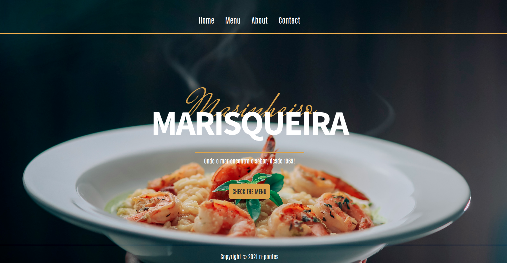

# Project: Restaurant-Page
A fictional restaurant SPA built for The Odin Project curriculum, focusing on modular JavaScript, Webpack bundling, and DOM-based content rendering. The site provides dynamic, reload-free navigation and responsive layouts across key pages like Home, Menu, About, and Contact.

# Features & Implementation
+ **SPA Behavior** – Dynamic content loading simulates multi-page navigation without full reloads.
+ **Modular JavaScript** – Organized with ES6 modules for scalable, maintainable code.
+ **Responsive Design** – Flexbox-based layout adapts smoothly across screen sizes.
+ **Webpack Integration** – Bundled assets for optimized performance and code splitting.
+ **Custom Scrollbars** – Enhanced UI with styled scrollbars on the Menu section.
+ **Clean UI/UX** – Thoughtful typography and color palette for a polished visual experience.

## Learning Outcomes
+ Enhanced my understanding of modular JavaScript and ES6 modules
+ Gained experience in creating a responsive and visually appealing user interface
+ Improved my CSS skills, including advanced layout techniques like Flexbox
+ Strengthened problem-solving skills through debugging and optimizing navigation

# Live Demo


## Built With
### Technologies
+ HTML5
+ CSS3 (Flexbox, custom scrollbars)
+ JavaScript (ES6 Modules)
+ Webpack (module bundler)

### Tools
+ Visual Studio Code
+ Linux Terminal
+ Git & GitHub

## Installation
1. Clone the repository:
   ```sh
   git clone https://github.com/n-pontes/restaurant-page.git